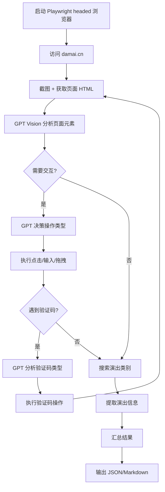

# Damai Search - 智能演出搜索工具设计方案

## 项目概述

基于 Playwright (headed 模式) + Azure GPT Vision Agent 的智能大麦网演出搜索工具，能够自动搜索演唱会、话剧、歌剧、livehouse 等演出信息，并通过 GPT 智能决策处理页面交互和验证码。

## 核心技术栈

- **浏览器自动化**: Playwright (headed 模式，非 headless)
- **AI 决策引擎**: Azure GPT-4 Vision API
- **UI 元素识别**: 截图 + GPT Vision 分析控件属性
- **验证码处理**: GPT 决策 + Playwright 拖拽/点击操作

## 系统架构

### 1. 核心模块

```
damai_search.py
├── DamaiSearcher (主类)
│   ├── __init__() - 初始化配置
│   ├── call_gpt_vision() - 调用 Azure GPT Vision API
│   ├── analyze_page_elements() - 分析页面元素并获取 GPT 决策
│   ├── handle_captcha() - 智能验证码处理
│   ├── search_category() - 搜索特定类别演出
│   ├── extract_event_info() - 提取演出信息
│   └── run() - 主执行流程
```

### 2. 工作流程



### 3. GPT Vision Agent 决策机制

#### 输入信息
- **页面截图**: Base64 编码的 PNG 图片
- **页面结构**: 简化的 HTML DOM 树
- **控件信息**: 元素的 selector、text、role、位置等属性
- **当前任务**: 搜索目标、当前步骤

#### 输出决策
```json
{
  "action": "click|input|drag|wait|scroll",
  "target": {
    "selector": "css_selector",
    "text": "元素文本",
    "coordinates": {"x": 100, "y": 200}
  },
  "value": "输入值或拖拽距离",
  "reasoning": "决策理由"
}
```

### 4. 验证码处理策略

#### 滑块验证码
1. GPT Vision 识别滑块和目标位置
2. 计算拖拽距离
3. Playwright 模拟人类拖拽轨迹（加速-匀速-减速）

#### 点选验证码
1. GPT Vision 识别验证码题目（如"点击所有的猫"）
2. 分析图片识别目标对象
3. 返回点击坐标序列
4. Playwright 依次点击

#### 文字验证码
1. GPT Vision OCR 识别文字
2. 返回识别结果
3. Playwright 输入文字

### 5. 搜索类别配置

```python
SEARCH_CATEGORIES = {
    "演唱会": {
        "url": "https://www.damai.cn/search.htm?ctl=演唱会",
        "keywords": ["演唱会", "音乐会", "concert"]
    },
    "话剧": {
        "url": "https://www.damai.cn/search.htm?ctl=话剧",
        "keywords": ["话剧", "戏剧", "drama"]
    },
    "歌剧": {
        "url": "https://www.damai.cn/search.htm?ctl=歌剧",
        "keywords": ["歌剧", "opera"]
    },
    "livehouse": {
        "url": "https://www.damai.cn/search.htm?ctl=livehouse",
        "keywords": ["livehouse", "live", "现场"]
    }
}
```

### 6. 数据提取结构

```python
{
  "category": "演唱会",
  "events": [
    {
      "title": "周杰伦演唱会",
      "date": "2026-03-15",
      "venue": "北京鸟巢",
      "price_range": "380-1280元",
      "status": "在售",
      "url": "https://detail.damai.cn/item.htm?id=xxx",
      "image": "https://img.damai.cn/xxx.jpg"
    }
  ],
  "total_count": 50,
  "search_time": "2026-01-23 18:19:00"
}
```

## 实现细节

### 1. Playwright 配置

```python
browser = await playwright.chromium.launch(
    headless=False,  # 必须是 headed 模式
    args=[
        '--disable-blink-features=AutomationControlled',
        '--disable-dev-shm-usage',
        '--no-sandbox'
    ]
)
context = await browser.new_context(
    viewport={'width': 1920, 'height': 1080},
    user_agent='Mozilla/5.0 ...',
    locale='zh-CN'
)
```

### 2. GPT Vision API 调用

```python
async def call_gpt_vision(screenshot_base64: str, page_info: dict) -> dict:
    messages = [
        {
            "role": "system",
            "content": "你是一个网页自动化专家..."
        },
        {
            "role": "user",
            "content": [
                {"type": "text", "text": f"当前任务: {task}"},
                {"type": "image_url", "image_url": {"url": f"data:image/png;base64,{screenshot_base64}"}}
            ]
        }
    ]
    
    response = await openai.ChatCompletion.create(
        engine=AZURE_OPENAI_DEPLOYMENT,
        messages=messages,
        max_tokens=1000
    )
    return json.loads(response.choices[0].message.content)
```

### 3. 智能元素定位

```python
async def get_page_elements(page: Page) -> dict:
    """提取页面关键元素信息"""
    elements = await page.evaluate("""
        () => {
            const elements = [];
            // 提取所有可交互元素
            document.querySelectorAll('button, input, a, [role="button"]').forEach(el => {
                const rect = el.getBoundingClientRect();
                elements.push({
                    tag: el.tagName,
                    text: el.innerText || el.value || '',
                    selector: generateSelector(el),
                    position: {x: rect.x, y: rect.y, width: rect.width, height: rect.height},
                    visible: rect.width > 0 && rect.height > 0
                });
            });
            return elements;
        }
    """)
    return elements
```

### 4. 人类化操作模拟

```python
async def human_like_drag(page: Page, start_x: int, start_y: int, distance: int):
    """模拟人类拖拽行为"""
    steps = 20
    await page.mouse.move(start_x, start_y)
    await page.mouse.down()
    
    for i in range(steps):
        # 贝塞尔曲线轨迹
        progress = i / steps
        current_x = start_x + distance * (progress ** 2)
        jitter = random.randint(-2, 2)
        await page.mouse.move(current_x, start_y + jitter)
        await asyncio.sleep(random.uniform(0.01, 0.03))
    
    await page.mouse.up()
```

## 输出格式

### 终端输出
```
🎭 大麦网演出搜索结果
==========================================

📍 演唱会 (共 50 场)
--------------------
1. 周杰伦演唱会 2026
   📅 2026-03-15 | 📍 北京鸟巢 | 💰 380-1280元
   🔗 https://detail.damai.cn/item.htm?id=xxx

2. 五月天演唱会
   📅 2026-04-20 | 📍 上海体育场 | 💰 480-1580元
   🔗 https://detail.damai.cn/item.htm?id=yyy

...
```

### JSON 输出
保存到 `damai_results_{timestamp}.json`

## 依赖更新

需要在 `requirements.txt` 添加:
```
Pillow>=10.0.0  # 图片处理
```

## 使用方式

```bash
# 基本使用
python damai_search.py

# 指定类别
python damai_search.py --categories 演唱会,话剧

# 指定城市
python damai_search.py --city 北京

# 输出到文件
python damai_search.py --output damai_results.json
```

## 注意事项

1. **反爬虫策略**: 使用 headed 模式 + 随机延迟 + 人类化操作
2. **验证码处理**: GPT Vision 可能无法 100% 识别，需要重试机制
3. **速率限制**: 添加请求间隔，避免被封 IP
4. **错误恢复**: 保存中间状态，支持断点续传
5. **成本控制**: GPT Vision API 调用成本较高，需要优化调用频率

## 后续优化

1. 添加代理池支持
2. 实现分布式爬取
3. 添加数据库存储
4. 实现增量更新
5. 添加邮件/微信通知
